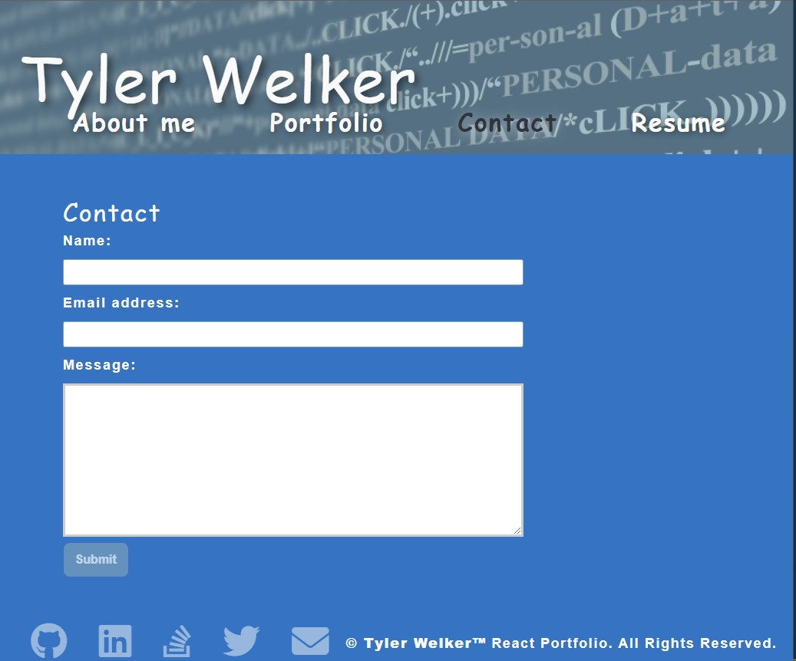
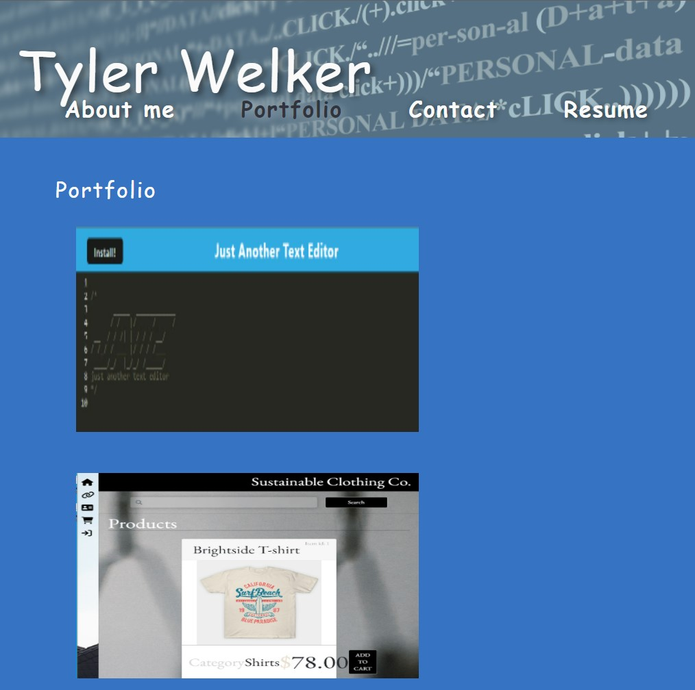
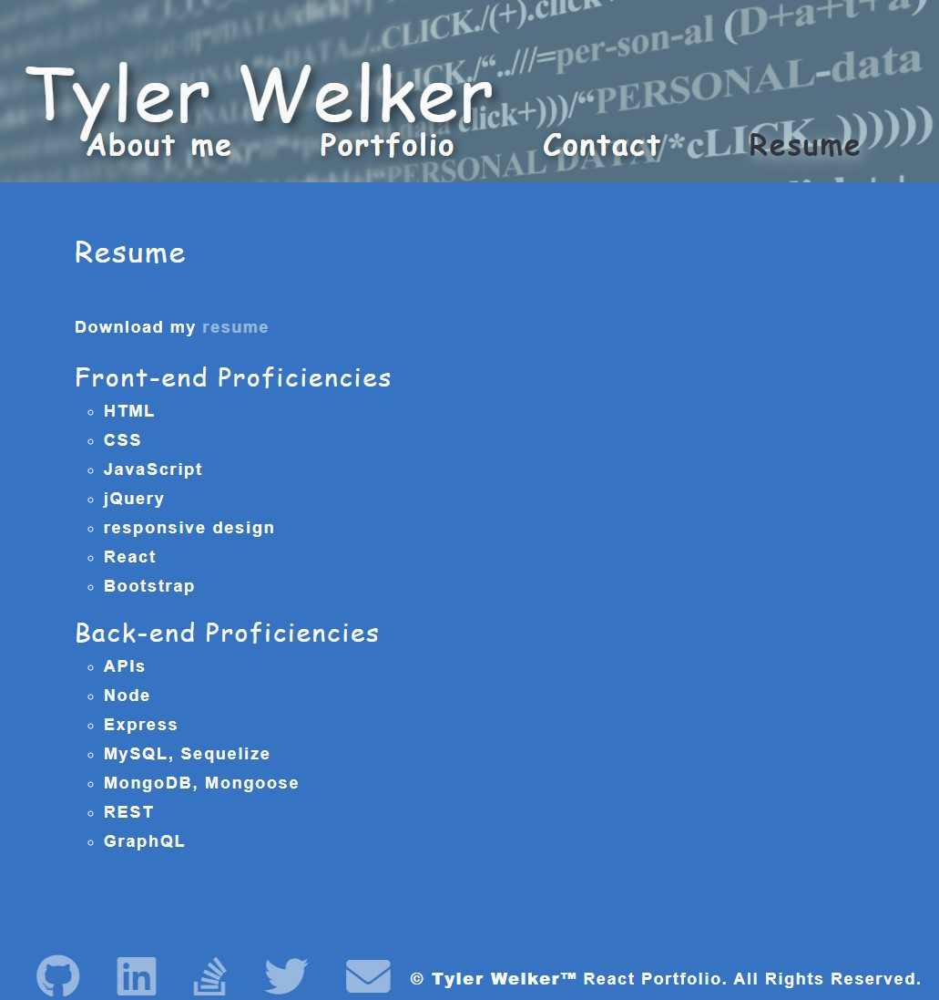

# React Portfolio

## Description
This is a portfolio page displays my skills and education. This displays projects I created and projects I collaberated on. This is a site to showcase me and my abilities and has a PDF of my resume and a way to contact me for any questions or even job opportunities.
## Table of Contents
- [Technologies Used](#technologies-used)
- [Functionality](#functionality)
- [Credits](#credits)
- [License](#license)
## Technologies Used
- React
- Node.js
- JavaScript
- CSS
- HTML
## Functionality
- Header:
    - The header has my name displayed as well as the navbar
- Navbar:
    - About Me: has a small bio
    - Protfolio: has a list of projects I worked on or created
    - Cantact: has a form to send me an email to contact me
    - Resume: has a list of my skill set as well as a link to download my resume
- About Me Page:
    - Porfolio photo
    - A few things about me.
- Portfolio Page:
    - [Text Editor](https://github.com/TWelk/TextEditor)
    - [Group Project 2](https://github.com/microjess/project2)
    - [Tech Blog](https://github.com/TWelk/TechBlog)
    - [Note Taker](https://github.com/TWelk/NoteTaker)
    - [Group project - Anonymous Alcoholics](https://github.com/grdnd/group-project)
    - [Rock, Paper, Scissors](https://github.com/TWelk/rpsproject)
- Contact Page:
    - Fill out the form
        - Name
        - Email Address
        - Message
- Footer:
    - Social Links
        - [GitHub](https://github.com/TWelk)
        - [LinkedIn](https://www.linkedin.com/in/tylerwelker297/)
        - [StackOverflow](https://stackoverflow.com/users/14720298/twelk)
        - [Twitter](https://twitter.com/TylerWelker11)
        - [Email](mailto:twelker08@gmail.com)
## Credits
TWelker
## License
MIT
## Screenshots
  

## Preview

## Live Site
* [Live](https://twelk.github.io/reactportforlio/)
## Repo Link
* [Repo](https://github.com/TWelker/reactportfolio)